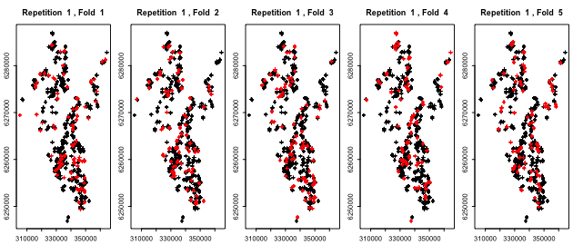

```{r setup, include=FALSE}
knitr::opts_chunk$set(eval = FALSE)
```

# Introduction

Geospatial data scientists often make use of a variety of statistical and machine learning techniques for spatial prediction in applications such as landslide susceptibility modeling [@Goetz2015] or habitat modeling [@Knudby2010]. Novel and often more flexible techniques promise improved predictive performances as they are better able to represent nonlinear relationships or higher-order interactions between predictors than less flexible linear models.

Nevertheless, this increased flexibility comes with the risk of possible over-fitting to the training data. Since nearby spatial observations often tend to be more similar than distant ones, traditional random cross-validation is unable to detect this over-fitting whenever spatial observations are close to each other (e.g. @Brenning2005). Spatial cross-validation addresses this by resampling the data not completely randomly, but using larger spatial regions. In some cases, spatial data is grouped, e.g. in remotely-sensed land use mapping grid cells belonging to the same field share the same management procedures and cultivation history, making them more similar to each other than to pixels from other fields with the same crop type.

The [sperrorest](https://pat-s.github.io/sperrorest/index.html) package provides a customizable toolkit for cross-validation (and bootstrap) estimation using a variety of spatial resampling schemes. More so, this toolkit can even be extended to spatio-temporal data or other complex data structures. This blog post will walk you through a simple case study, crop classification in central Chile [@Pena2015].

# Data and Packages

As a case study we will carry out a supervised classification analysis using remotely-sensed data to predict fruit-tree crop types in central Chile. This data set is a subsample of data from [@Pena2015].

```{r, message=FALSE}
library(pacman)
p_load(sperrorest)
```

```{r}
data("maipo", package = "sperrorest")
```

The remote-sensing predictor variables were derived from an image times series consisting of eight Landsat images acquired throughout the (southern hemisphere) growing season. The data set includes the following variables:

**Response**  
  - `croptype`: response variable (factor) with 4 levels: ground truth information  
  
**Predictors**  
  - `b`[12-87]: spectral data, e.g. b82 = image date #8, spectral band #2  
  - `ndvi`[01-08]: Normalized Difference Vegetation Index, e.g. #8 = image date #8  
  - `ndwi`[01-08]: Normalized Difference Water Index, e.g. #8 = image date #8  
  
**Others**  
  - `field`: field identifier (grouping variable - not to be used as predictor)  
  - `utmx`, `utmy`: x/y location; not to be used as predictors  

All but the first four variables of the data set are predictors; their names are used to construct a formula object:

```{r}
predictors <- colnames(maipo)[5:ncol(maipo)]
# Construct a formula:
fo <- as.formula(paste("croptype ~", paste(predictors, collapse = "+")))
```

# Modeling

Here we will take a look at a few classification methods with varying degrees of computational complexity and flexibility. This should give you an idea of how different models are handled by `sperrorest`, depending on the characteristics of their fitting and prediction methods. Please refer to [@James2013] for background information on the models used here.

## Linear Discriminant Analysis (LDA)

LDA is simple and fast, and often performs surprisingly well if the problem at hand is 'linear enough'. As a start, let's fit a model with all predictors and using all available data:

```{r}
p_load(MASS)
fit <- lda(fo, data = maipo)
```

Predict the croptype with the fitted model and calculate the misclassification error rate (MER) on the training sample:
```{r}
pred <- predict(fit, newdata = maipo)$class
mean(pred != maipo$croptype)
```

```
## [1] 0.0437
```


But remember that this result is over-optimistic because we are re-using the training sample for model evaluation. We will soon show you how to do better with cross-validation.

We can also take a look at the confusion matrix but again, this result is overly optimistic:
```{r}
table(pred = pred, obs = maipo$croptype)
```

```
##         obs
##   pred  crop1 crop2 crop3 crop4
##   crop1  1294     8     4    37
##   crop2    50  1054     4    44
##   crop3     0     0  1935     6
##   crop4    45   110    29  3093
```

## Classification Tree

Classification and regresion trees (CART) take a completely different approach---they are based on yes/no questions in the predictor variables and can be referred to as a binary partitioning technique. Fit a model with all predictors and default settings:

```{r, message=FALSE}
p_load(rpart)
```

```{r}
fit <- rpart(fo, data = maipo)

## optional: view the classiciation tree
# par(xpd = TRUE)
# plot(fit)
# text(fit, use.n = TRUE)
```

Again, predict the croptype with the fitted model and calculate the average MER:
```{r}
pred <- predict(fit, newdata = maipo, type = "class")
mean(pred != maipo$croptype)
```

```
## [1] 0.113
```

Here the `predict` call is slightly different. Again, we could calculate a confusion matrix.

```{r}
table(pred = pred, obs = maipo$croptype)
```

```
##         obs
##   pred  crop1 crop2 crop3 crop4
##   crop1  1204    66     0    54
##   crop2    47   871    38   123
##   crop3    38     8  1818    53
##   crop4   100   227   116  2950
```

## RandomForest 

Bagging, bundling and random forests build upon the CART technique by fitting many trees on bootstrap resamples of the original data set [@Breiman1996] [@Breiman2001] [@Hothorn2005]. They differ in that random forest also samples from the predictors, and bundling adds an ancillary classifier for improved classification. We will use the nowadays widely used `randomForest()` here.

```{r, message=FALSE}
p_load(randomForest)
```

```{r}
fit <- randomForest(fo, data = maipo, coob = TRUE)
fit
```

```
## 
## Call:
##  randomForest(formula = fo, data = maipo, coob = TRUE) 
##                Type of random forest: classification
##                      Number of trees: 500
## No. of variables tried at each split: 8
## 
##         OOB estimate of  error rate: 0.57%
## Confusion matrix:
##       crop1 crop2 crop3 crop4 class.error
## crop1  1382     2     0     5     0.00504
## crop2     1  1163     0     8     0.00768
## crop3     0     0  1959    13     0.00659
## crop4     7     5     3  3165     0.00472
```


Let's take a look at the  MER achieved on the training sample: 
```{r}
pred <- predict(fit, newdata = maipo, type = "class")
mean(pred != maipo$croptype)
```

```
## [1] 0
```


```{r}
table(pred = pred, obs = maipo$croptype)
```

```
##         obs
##   pred  crop1 crop2 crop3 crop4
##   crop1  1389     0     0     0
##   crop2     0  1172     0     0
##   crop3     0     0  1972     0
##   crop4     0     0     0  3180
```

Isn't this amazing? Only one grid cell is misclassified by the bagging classifier! Even the OOB (out-of-bag) estimate of the error rate is < 1%.  
Too good to be true? We'll see...

# Cross-Validation Estimation of Predictive Performance

Of course we can't take the MER on the training set too seriously---it is biased. But we've heard of cross-validation, in which disjoint subsets are used for model training and testing. Let's use `sperrorest` for cross-validation.

Also, at this point we should highlight that the observations in this data set are pixels, and multiple grid cells belong to the same field. In a predictive situation, and when field boundaries are known (as is the case here), we would want to predict the same class for all grid cells that belong to the same field. Here we will use a majority filter. This filter ensures that the final predicted class type of every field is the most often predicted croptype within one field. 

## Linear Discriminant Analysis (LDA)

First, we need to create a wrapper predict method for LDA for `sperrorest()`. This is necessary in order to accomodate the majority filter, and also because class predictions from `lda`'s predict method are hidden in the `$class` component of the returned object.

```{r}
lda.predfun <- function(object, newdata, fac = NULL) {
  
  p_load(nnet)
  majority <- function(x) {
    levels(x)[which.is.max(table(x))]
  }
  
  majority.filter <- function(x, fac) {
    for (lev in levels(fac)) {
      x[fac == lev] <- majority(x[fac == lev])
    }
    x
  }
  
  pred <- predict(object, newdata = newdata)$class
  if (!is.null(fac)) pred <- majority.filter(pred, newdata[, fac]) 
  return(pred)
}
```

To ensure that custom predict-functions do also work with `parsperrorest()`, we need to define all custom functions in one step. Otherwise, the `foreach()` package in `par.mode = 2` of `parsperrorest()` will throw errors because of the way how it loads functions of the parent environment. 

Finally, we can run `sperrorest()` with a non-spatial sampling setup (`partition.cv()`). In this example we use a '50 repetitions - 5 folds' setup. To make your results more independent of particular random partitioning, you may want to use 100 repetitions or even more in practice. 

```{r}
res.lda.nsp <- sperrorest(fo, data = maipo, coords = c("utmx","utmy"), 
                          model.fun = lda,
                          pred.fun = lda.predfun, 
                          pred.args = list(fac = "field"),
                          smp.fun = partition.cv, 
                          smp.args = list(repetition = 1:50, nfold = 5),
                          error.rep = TRUE, error.fold = TRUE,
                          progress = FALSE)
```

```{r}
summary(res.lda.nsp$error.rep)
```

```
##                    mean    sd   median   IQR
## train.error    3.40e-02 0.001 3.40e-02 0.001
## train.accuracy 9.66e-01 0.001 9.66e-01 0.001
## train.events   4.69e+03 0.000 4.69e+03 0.000
## train.count    3.09e+04 0.000 3.09e+04 0.000
## test.error     4.00e-02 0.002 4.00e-02 0.002
## test.accuracy  9.60e-01 0.002 9.60e-01 0.002
## test.events    1.17e+03 0.000 1.17e+03 0.000
## test.count     7.71e+03 0.000 7.71e+03 0.000
```

To run a spatial cross-validation at the field level, we can use `partition.factor.cv()` as the sampling function. Since we are using 5 folds, we get a coarse 80/20 split of our data. 80% will be used for training, 20% for testing our trained model.

To take a look where our training and tests sets will be partitioned on each fold, we can plot them. The red colored points represent the test set in each fold, the black colored points the training set. Note that because we plotted over 7000 points, overplotting occurs and since the red crosses are plotted after the black ones, it seems visually that way more than ~20% of red points exist than it is really the case. 

```{r , echo = FALSE}
png(filename = "../inst/figure/resamp-plot.png", width = 7, height = 3, units = "in", res = 90)
resamp <- partition.factor.cv(maipo, nfold = 5, repetition = 1:1, fac = "field")
plot(resamp, maipo, coords = c("utmx","utmy"))
dev.off()
```

```{r }
resamp <- partition.factor.cv(maipo, nfold = 5, repetition = 1:1, fac = "field")
plot(resamp, maipo, coords = c("utmx","utmy"))
```



Subsequently, we have to specify the location of the fields (`fac = "field"`) in the prediction arguments (`pred.args`) and sampling arguments (`smp.args`) in `sperrorest()`.

```{r sperro-lda}
res.lda.sp <- sperrorest(fo, data = maipo, coords = c("utmx","utmy"), 
                         model.fun = lda,
                         pred.fun = lda.predfun, 
                         pred.args = list(fac = "field"),
                         smp.fun = partition.factor.cv,
                         smp.args = list(fac = "field", repetition = 1:50, nfold = 5),
                         error.rep = TRUE, error.fold = TRUE, 
                         benchmark = TRUE, progress = FALSE)
res.lda.sp$benchmark$runtime.performance
```

```{r}
summary(res.lda.sp$error.rep)
```

```
##                    mean      sd   median     IQR
## train.error    2.95e-02 0.00177 2.97e-02 0.00261
## train.accuracy 9.70e-01 0.00177 9.70e-01 0.00261
## train.events   4.69e+03 0.00000 4.69e+03 0.00000
## train.count    3.09e+04 0.00000 3.09e+04 0.00000
## test.error     6.65e-02 0.00807 6.59e-02 0.01083
## test.accuracy  9.33e-01 0.00807 9.34e-01 0.01083
## test.events    1.17e+03 0.00000 1.17e+03 0.00000
## test.count     7.71e+03 0.00000 7.71e+03 0.00000
```

## RandomForest

In the case of Random Forest, the customized `pred.fun` looks as follows; it is only required because of the majority filter, without it, we could just omit the `pred.fun` and `pred.args` arguments below. 

```{r def-rf-predfun}
rf.predfun <- function(object, newdata, fac = NULL) {
  
  p_load(nnet)
  majority <- function(x) {
    levels(x)[which.is.max(table(x))]
  }
  
  majority.filter <- function(x, fac) {
    for (lev in levels(fac)) {
      x[fac == lev] <- majority(x[fac == lev])
    }
    x
  }
  
  pred <- predict(object, newdata = newdata)
  if (!is.null(fac)) pred <- majority.filter(pred, newdata[,fac]) 
  return(pred)
}
```

```{r sperro-rf}
res.rf.sp <- sperrorest(fo, data = maipo, coords = c("utmx","utmy"), 
                          model.fun = randomForest,
                          pred.fun = rf.predfun,
                          pred.args = list(fac = "field"),
                          smp.fun = partition.factor.cv,
                          smp.args = list(fac = "field",
                                          repetition = 1:50, nfold = 5),
                          error.rep = TRUE, error.fold = TRUE,
                          benchmark = TRUE, progress = 2)
```

```
## Mon Feb 27 20:56:01 2017 Repetition 1 
## Mon Feb 27 20:57:12 2017 Repetition 2 
## Mon Feb 27 20:58:20 2017 Repetition 3 
## Mon Feb 27 20:59:29 2017 Repetition 4 
## Mon Feb 27 21:00:36 2017 Repetition 5 
## Mon Feb 27 21:01:46 2017 Repetition 6 
## Mon Feb 27 21:02:55 2017 Repetition 7 
## Mon Feb 27 21:04:01 2017 Repetition 8 
## Mon Feb 27 21:05:07 2017 Repetition 9 
## Mon Feb 27 21:06:16 2017 Repetition 10 
## Mon Feb 27 21:07:23 2017 Repetition 11 
## Mon Feb 27 21:08:30 2017 Repetition 12 
## Mon Feb 27 21:09:38 2017 Repetition 13 
## Mon Feb 27 21:10:45 2017 Repetition 14 
## Mon Feb 27 21:11:53 2017 Repetition 15 
## Mon Feb 27 21:13:01 2017 Repetition 16 
## Mon Feb 27 21:14:09 2017 Repetition 17 
## Mon Feb 27 21:15:16 2017 Repetition 18 
## Mon Feb 27 21:16:23 2017 Repetition 19 
## Mon Feb 27 21:17:31 2017 Repetition 20 
## Mon Feb 27 21:18:39 2017 Repetition 21 
## Mon Feb 27 21:19:46 2017 Repetition 22 
## Mon Feb 27 21:20:53 2017 Repetition 23 
## Mon Feb 27 21:22:03 2017 Repetition 24 
## Mon Feb 27 21:23:13 2017 Repetition 25 
## Mon Feb 27 21:24:23 2017 Repetition 26 
## Mon Feb 27 21:25:32 2017 Repetition 27 
## Mon Feb 27 21:26:39 2017 Repetition 28 
## Mon Feb 27 21:27:47 2017 Repetition 29 
## Mon Feb 27 21:28:55 2017 Repetition 30 
## Mon Feb 27 21:30:03 2017 Repetition 31 
## Mon Feb 27 21:31:11 2017 Repetition 32 
## Mon Feb 27 21:32:18 2017 Repetition 33 
## Mon Feb 27 21:33:25 2017 Repetition 34 
## Mon Feb 27 21:34:33 2017 Repetition 35 
## Mon Feb 27 21:35:40 2017 Repetition 36 
## Mon Feb 27 21:36:47 2017 Repetition 37 
## Mon Feb 27 21:37:54 2017 Repetition 38 
## Mon Feb 27 21:39:02 2017 Repetition 39 
## Mon Feb 27 21:40:09 2017 Repetition 40 
## Mon Feb 27 21:41:17 2017 Repetition 41 
## Mon Feb 27 21:42:24 2017 Repetition 42 
## Mon Feb 27 21:43:31 2017 Repetition 43 
## Mon Feb 27 21:44:38 2017 Repetition 44 
## Mon Feb 27 21:45:46 2017 Repetition 45 
## Mon Feb 27 21:46:54 2017 Repetition 46 
## Mon Feb 27 21:48:01 2017 Repetition 47 
## Mon Feb 27 21:49:07 2017 Repetition 48 
## Mon Feb 27 21:50:15 2017 Repetition 49 
## Mon Feb 27 21:51:21 2017 Repetition 50 
## Mon Feb 27 21:52:27 2017 Done.

res.rf.sp$benchmark$runtime.performance
## Time difference of 56.4 mins
```


```{r}
summary(res.rf.sp$error.rep$test.error)
```

```
##    Min. 1st Qu.  Median    Mean 3rd Qu.    Max. 
##  0.0630  0.0827  0.0871  0.0868  0.0928  0.1100
```


```{r}
summary(res.rf.sp$error.rep$test.accuracy)
```

```
##    Min. 1st Qu.  Median    Mean 3rd Qu.    Max. 
##   0.890   0.907   0.913   0.913   0.917   0.937
```


What a surprise! RandomForest classification isn't that good after all, if we acknowledge that in 'real life' we wouldn't be making predictions in situations where the class membership of other grid cells in the same field is known in the training stage. So spatial dependence does matter.

## Parallelized Cross-Validation

To speed things up, we can use `parsperrorest()` and inspect the runtime difference. Note that we have two parallel modes to choose from!  
In this example we will use both `par.mode = 1` and `par.mode = 2` to show you the runtime differences.

**Details of argument `par.mode`**

The advantage of `par.mode = 1` compared to `par.mode = 2` is its speed. However, `par.mode = 1` is somewhat less stable. This means that `par.mode = 1` will throws errors for some models (e.g. LDA) while `par.mode = 2` does not. `par.mode = 1` uses either a `parallel::mclapply()` (Unix) or `parallel::parApply()` (Windows) while `par.mode = 2` is running on a `foreach` backend. 

While traditional `mclapply()` approaches have the downside that no progress report can be printed, the `pbapply` package implemented in `parsperrorest()` provides progress output (showing a progress bar) and does even work cross-platform. `par.mode = 1` does not show a progress bar but prints fold and/or repetition information to the console.

```{r parsperro-rf-mode1}
res.rf.sp.par1 <- parsperrorest(fo, data = maipo, coords = c("utmx","utmy"), 
                               model.fun = randomForest,
                               pred.fun = rf.predfun,
                               pred.args = list(fac = "field"),
                               smp.fun = partition.factor.cv,
                               smp.args = list(fac = "field", 
                                               repetition = 1:50, nfold = 5),
                               par.args = list(par.units = 4, par.mode = 1),
                               error.rep = TRUE, error.fold = TRUE,
                               benchmark = TRUE, progress = FALSE)
```

```{r}
res.rf.sp.par1$benchmarks$runtime.performance
```

```
## Time difference of 18 mins
```

```{r parsperro-rf-mode2}
res.rf.sp.par2 <- parsperrorest(fo, data = maipo, coords = c("utmx","utmy"), 
                                model.fun = randomForest,
                                pred.fun = rf.predfun,
                                pred.args = list(fac = "field"),
                                smp.fun = partition.factor.cv,
                                smp.args = list(fac = "field", 
                                                repetition = 1:50, nfold = 5),
                                par.args = list(par.units = 4, par.mode = 2),
                                error.rep = TRUE, error.fold = TRUE,
                                benchmark = TRUE, progress = FALSE)
```

```{r}
res.rf.sp.par2$benchmarks$runtime.performance
```

```
## Time difference of 19.9 mins
```


Both the differences of the parallel methods (`parsperrorest()`) compared to the sequential one (`sperrorest()`) and between the parallel modes themselves can be seen as variance among the repetitions. If you would use more repetitions (e.g. 100), this difference would converge towards zero. 

### Results of par.mode = 1

```{r}
summary(res.rf.sp.par1$error.rep$test.error)
```

```
##    Min. 1st Qu.  Median    Mean 3rd Qu.    Max. 
##  0.0744  0.0813  0.0852  0.0862  0.0903  0.1090
```

```{r}
summary(res.rf.sp.par1$error.rep$test.accuracy)
```

```
##    Min. 1st Qu.  Median    Mean 3rd Qu.    Max. 
##   0.891   0.910   0.915   0.914   0.919   0.926
```

### Results of par.mode = 2

```{r}
summary(res.rf.sp.par2$error.rep$test.error)
```

```
##    Min. 1st Qu.  Median    Mean 3rd Qu.    Max. 
##  0.0638  0.0832  0.0874  0.0872  0.0926  0.1130
```

```{r}
summary(res.rf.sp.par2$error.rep$test.accuracy)
```

```
##    Min. 1st Qu.  Median    Mean 3rd Qu.    Max. 
##   0.887   0.907   0.913   0.913   0.917   0.936
```

# Usage Advices

Given all the different sampling functions and the custom predict function (`rf.predfun()`) you might be a little confused which function to use for your use case.  
If you want to do a "normal", i.e. **non-spatial cross-validation** we recommend to use `partition.cv()` as `smp.fun` in `sperrorest()` or `parsperrorest()`.  
If you want to perform a **spatial cross-validation** and you do not have a grouping structure like fields in our example, you should use `partition.kmeans()` as `smp.fun`. This creates a spatial k-means clustering within your cross-validation runs.  

Most often you can simply use the generic `predict()` method for your model. Only in cases where you want to do prediction based on some factor level like in this vignette, you need to write your own prediction function. 

**Wrapper functions**

Another point to be aware of is that some model functions do use a different argument naming/order than the `model.fun()` argument of `sperrorest()` expects (formula + data). For example, the formula argument of `glmmPQL()` is named `fixed` instead of `formula`.  
Also sometimes you may encounter errors when providing spatial correlation structures to your model using `model.args`. If this happens, also try to provide the correlation structure within a wrapper function.

```{r}
my_glmmPQL <- function(formula, data) {
  
  # calculate spatial correlation structure
  correlation = corSpatial(value = c(5024, 0.25), form = ~ry + rx, nugget = TRUE,
                           fixed = FALSE, type = "spherical")
  correlation = Initialize(correlation, data = data)
  
  # actual model.fun
  glmmPQL(fixed = formula, data = data, correlation = correlation)
}
```

For all further questions, please feel free to open an issue at our [Github repo](https://github.com/pat-s/sperrorest).


# References
